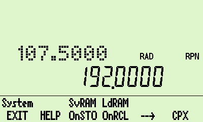
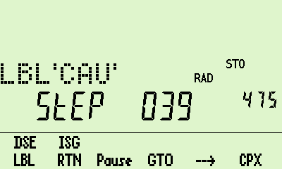
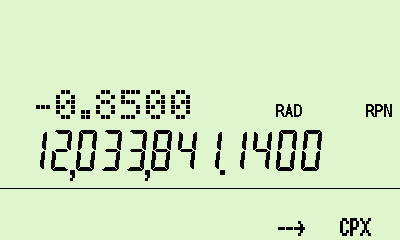

# WP34S calculator for DM42 hardware

## A project to bring the WP34s calculator firmware to the DM42 hardware. 

   

To install this program on your DM42 calculator, you need to:

  * Copy the file build/wp34s.pgm into the root folder of your DM42's flash drive.
  * Copy the file help/wp34s_help.html to the HELP folder on your DM42's flash drive.
  * From the DMCP menu on your DM42, select option **3 - Load Program**, select the wp34s.pgm file, and follow the prompts.

Once it is running you have all of the basic features of the WP34s calculator, with some additional file-handing functions. Printing and stopwatch-mode are currently **not** supported. (Of the various compile-time options in features.h, nothing more exotic than INCLUDE_YREG_CODE is turned on.)

The help file wp34s_help.html can be accessed from the calculator: press shift-0 (SETUP) and then the HELP key.

The program has been adapted to fit the keyboard layout of the DM42, so most keys do what they say. In particular, shift-EXIT turns the calculator off and EXIT turns it on again. To accomodate the huge number of functions available on the real WP34s keyboard there are several menus, which use the top row of function keys. 

**To exit the calculator**, for example to return to the DM42, press shift-0 (SETUP) and press the leftmost menu key (EXIT). This brings you to the DMCP menu; from here you can load a different .pgm file if you wish.

The project has two makefiles. I'm afraid that these have been written for use on a Linux computer only; I was unable to get things to work on Windows, whereas the experience on Linux was relatively painless. The makefile in src/ builds autogenerated files (constants, catalogues, etc.) that are compiled and/or run on the host computer; the makefile at the top level uses these and the rest of the source code to build libraries and code for the DM42 hardware.

Nearly all of the source code comes directly from the WP34s project; a vital contribution has come from the SDKdemo calculator source code and header files provided by SwissMicros. The SwissMicros code is covered by the BSD 3-clause licence, found in the file LICENSE; the WP34s code and my additions to it are covered by the GNU GPL3 licence, found in the file src/licence.h. The DMCP documentation [here](https://technical.swissmicros.com/dmcp/doc/DMCP-ifc-html/index.html) has been incredibly helpful and is much appreciated.

You will find the documentation for the original WP34s project, including the assembler suite, [here at Sourceforge.](https://sourceforge.net/projects/wp34s/files/doc/). You can also access the original source code.

Thanks once again to Walter, Paul, and Marcus, and to everyone else who helped with the initial project. Thanks  also to Jaco Mostert for keeping me interested in the WP34s and for showing, with his [WP43C project](https://forum.swissmicros.com/viewtopic.php?f=2&t=2216&sid=f05399d1ce12fdfff3090358078837d4), how a calculator can be adapted to the DM42 keyboard.