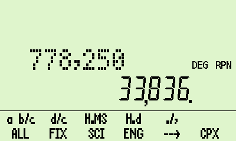
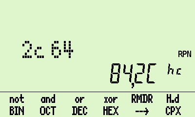
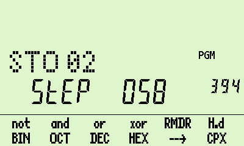
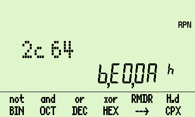
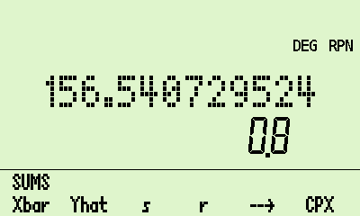
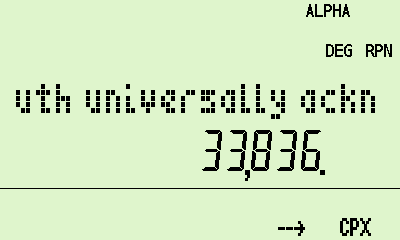
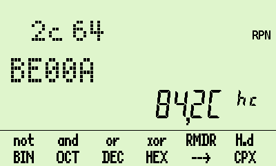
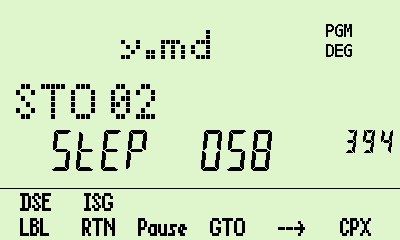
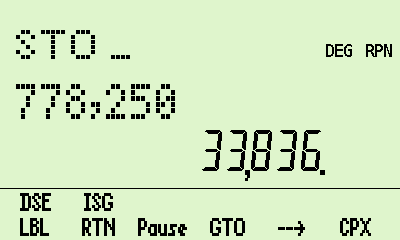
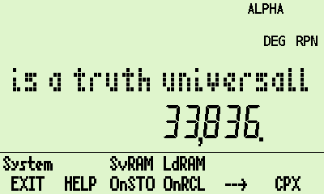

# WP34S calculator for DM42 hardware

## A project to bring the WP34s calculator firmware to the DM42 hardware. 

This project now provides three versions of the WP34s calculator for the DM42 which differ only in their displays.

  * **The "normal" version.** This reproduces the WP34s screen as closely as possible.

  

* **The "long" version.** This extends the alpha display region to the width of the DM42 display and moves the annunciators upwards.

  

* **The "top" version.** As well as the longer alpha display this version includes a "top row", which is used to display the annunciators that appear on the alpha display in the other two versions.

  
  

In all three versions some of the annunciators have been renamed - INPUT to ALPHA, STO to PGM, RCL to RUN, and 360 to DEG.

There is no difference in the speed at which programs run in the three versions. In principle the bigger the display, the slower the keyboard response, but to me at least this is not noticeable.

## To install the WP34s on your DM42 calculator:

  * Make sure that you have the DM42 firmware (e.g., DM42-3.17.pgm) on your flash drive, so that you can reload it when (if?) you exit the WP34s firmware.
  * Choose which of the three versions you want to use. 
  * Copy either `build/wp34s.pgm` (normal), `build/wp34s_long` (long), or `build/wp34s_top` (top) into the root folder of your DM42's flash drive. All of these files are found in the `master` branch of the gitlab repository.
  * Copy the file `help/wp34s_help.html` to the HELP folder on your DM42's flash drive.
  * From the DMCP menu on your DM42, select option **3 - Load Program**, select the .pgm file you wish to run, and follow the prompts.
  * **To leave the calculator**, for example to return to the DM42, press shift-0 (SETUP) and press the leftmost menu key (EXIT). This brings you to the DMCP menu; from here you can load a different .pgm file if you wish.

Once the .pgm file is running you have all of the basic features of the WP34s calculator, with some additional file-handing functions. Printing and stopwatch-mode are currently **not** supported. (Of the various compile-time options in features.h, nothing more exotic than INCLUDE_YREG_CODE is turned on.)

The help file `wp34s_help.html` can be accessed from the calculator: press shift-0 (SETUP) and then the HELP key.

The program has been adapted to fit the keyboard layout of the DM42, so most keys do what they say. In particular, shift-EXIT turns the calculator off and EXIT turns it on again. To accomodate the huge number of functions available on the real WP34s keyboard there are several menus, which use the top row of function keys. See the help file for more information.

## Building the project

If you wish to build the project yourself, note that the makefiles have been written for use under Linux only. I was unable to get things to work on Windows, whereas the experience on Linux (a VirtualBox virtual machine running Ubuntu) was relatively painless. 

  * In the top-level directory, type `make source`. This builds autogenerated files (constants, catalogues, etc.) that are compiled and/or run on the host computer; the makefile at the top level uses these and the rest of the source code to build libraries and code for the DM42 hardware.

  * Then, type either `make normal`, `make long`, or `make top` to build the version of your choice. If you want all three you still have to run `make` three times; typing just `make` is the same as `make top`.

## Licencing and thanks
Nearly all of the source code comes directly from the WP34s project; a vital contribution has come from the SDKdemo calculator source code and header files provided by SwissMicros. The SwissMicros code is covered by the BSD 3-clause licence, found in the file LICENSE; the WP34s code and my additions to it are covered by the GNU GPL3 licence, found in the file src/licence.h. The DMCP documentation [here](https://technical.swissmicros.com/dmcp/doc/DMCP-ifc-html/index.html) has been incredibly helpful and is much appreciated.

This software is not provided by SwissMicros, and they will not provide any support.

You will find the documentation for the original WP34s project, including the assembler suite, [here at Sourceforge.](https://sourceforge.net/projects/wp34s/files/doc/). You can also access the original source code.

Thanks once again to Walter, Paul, and Marcus, and to everyone else who contributed to the initial project. Thanks also to Jaco Mostert for keeping me interested in the WP34s and for showing, with his [WP43C project](https://forum.swissmicros.com/viewtopic.php?f=2&t=2216&sid=f05399d1ce12fdfff3090358078837d4), how a calculator can be adapted to the DM42 keyboard.

Many thanks also to dlachieze on the DM42 developers' forum for their suggestions and help finding bugs.