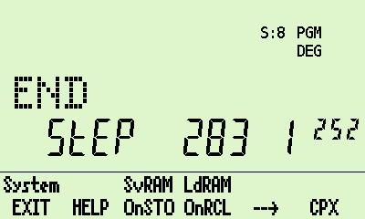

# WP&nbsp;34S calculator for DM42 hardware

## A project to bring the WP&nbsp;34S calculator firmware to the DM42 hardware. 

### Recent changes:
  * New display code. Previously the entire display was redrawn every time a key was pressed or when any part of the display changed. The DM42 hardware coped magnificently, but this method must surely increase power consumption if nothing else. The new code only redraws what has changed. I believe that all bugs have been corrected...if you want to stay with the previous version, I quite understand!

  * The wp34c and wp34s ("master" branch) code has been merged. You can now find both the wp34s and wp34c .pgm files in the the build directory of the master branch. The old wp34c branch has not been updated with the new display code, nor with the few changes detailed below. The wp34c files in the master branch are fully feature-equivalent with the wp34s files.

  * The printer graphics commands are now included. They appear to work.

  * The version of the program with a "top" row now displays (most) short messages there, rather than in the alpha row.

  * The "LdPRG" (load program) function now recognises and loads program files produced by the assembler as individual .dat files rather than as .lib library files.

  * There is also an experimental "4k" version - you'll find the 4k program files in the build/ directory, where the wp34s and wp34c files are. This expands the RAM from 2k to 4k, giving over 1500 program steps! The maximum number of registers doesn't increase, but you can (for example) have 100 double-precision registers along with about 1000 program steps. The disadvantage is that the wp34s_4k.dat file that contains the calculator state cannot be opened by other wp34s emulators, although the programs in it can be disassembled without difficulty. This screenshot shows a 283-step program with 1252 steps still remaining!

##Description
This version of the WP&nbsp;34S calculator now includes:

  * Infra-red printing, including printer graphics;

  * The stopwatch;

  * Complex lock mode;

  * Entry RPN;

  * User-defined menus;

  * Enhanced file handling.

There are three versions of the WP&nbsp;34S program which differ in their displays: normal, long, and top. The program files are, respectively, build/wp34s.pgm, build/wp34s_long.pgm, and build/wp34s_top.pgm.

  * **The "normal" version** reproduces the WP34s screen as closely as possible.

  

* **The "long" version** extends the alpha display region to the width of the DM42 display and moves the annunciators upwards.

  

* **The "top" version** includes a "top row", used to display the annunciators, along with the longer alpha display of the "long" version.

  
  

In all three versions some annunciators have been given more helpful names - details in the help file.

There is no difference in the speed at which programs run in the three versions. In principle the bigger the display, the slower the keyboard response, but to me at least this is not noticeable.

## To install the WP&nbsp;34S on your DM42 calculator:

  * Make sure that you have the DM42 firmware (e.g., DM42-3.19.pgm) on your flash drive, so that you can reload it when (if?!) you exit the WP&nbsp;34S firmware.
  * Choose which of the three versions you want to use. 
  * Copy either `build/wp34s.pgm` (normal), `build/wp34s_long` (long), or `build/wp34s_top` (top) into the root folder of your DM42's flash drive. All of these files are found in the `master` branch of the gitlab repository. (Of course, you can copy all three across and try them out one after the other!)
  * Copy the file `help/wp34s_help.html` to the HELP folder on your DM42's flash drive.
  * From the DMCP menu on your DM42, select option **3 - Load Program**, select the .pgm file you wish to run, and follow the prompts.
  * **To leave the calculator**, for example to reload the DM42 firmware, press SHIFT-0 (SETUP) and press the leftmost menu key (EXIT). This brings you to the DMCP menu; from here you can load a different .pgm file if you wish using menu option 3.

Once the .pgm file is running you have essentially all of the features of the WP34S calculator at your disposal, along with some additional file-handing functions and user-defined menus.

The program has been adapted to fit the keyboard layout of the DM42, so most keys do what they say. In particular, SHIFT-EXIT turns the calculator off and EXIT turns it on again. To accomodate the huge number of functions available on the real WP34S keyboard there are several menus, which use the top row of function keys. See the help file (SHIFT-0 (SETUP) and then the HELP key) for more information.

There is documentation available in the `help/` folder:

  * If you are not already familiar with the WP&nbsp;34S calculator, you should look at the WP&nbsp;34S manual or Beginners' Guide, copies of which can be found in the `help/` folder. (These have been copied here from the [WP&nbsp;34S Sourceforge page](https://sourceforge.net/projects/wp34s/).)
  * Details of how to use the DM42 version of the calculator can be found in the help file `help/wp34s_help.html`. This can be viewed in a browser; it can also be accessed from the calculator by pressing SHIFT-0 (SETUP) and then the HELP key.
  * For a quick introduction to the DM42 version, see the quick reference guide produced by Didier Lachieze `help/QRG-booklet_1.0.pdf`.
  * Other documents deal with complex lock mode, user-defined menus, entry RPN mode, and IR printing. 

## Complex Lock Mode

On the original calculator, complex lock mode was designed to make the entry and display of complex numbers more straightforward. To fit the code in, some features of the normal calculator had to be omitted. Also, some memory was needed for extra flags, changing the memory layout from that of a "normal" WP&nbsp;34S.

Because of this, the complex lock mode firmware was given its own name - the WP 34C.

Now on the DM42 this mode has been fully integrated with the WP&nbsp;34S. Nothing has been omitted, and the memory layout is that of a standard WP&nbsp;34S. Because of this there is no need for two separate programs. If you never use complex lock mode its presence will not affect you, but it's there is you want it!

When complex-lock mode is activated, entering a number displays "Real:" on the status line. Pressing "CPX" then terminates the entry of the real part and displays "Imag:", allowing the entry of the imaginary part. Entry in polar form, with "Length:" and "Angle:" displayed, is also supported.

Once entered, (almost) every keyboard operation operates in complex mode, without the need to press "CPX" first. Even STO and RCL store and recall a pair of registers at a time. The aim is to make working with complex numbers as simple as working with real numbers.

In complex lock mode there are no integer-mode functions, no statistics, and no programming. But you can easily leave complex lock mode to access these features!

## Building the project

If you wish to build the project yourself, note that the makefiles have been written for use under Linux only. I was unable to get things to work on Windows, whereas the experience on Linux (a VirtualBox virtual machine running Ubuntu) was relatively painless. 

  * Go into the src/ directory and type 'make clean'. Return to the top-level directory.

  * In the top-level directory, type 'make source'. This builds autogenerated files (constants, catalogues, etc.) that are compiled and/or run on the host computer; the makefile at the top level uses these and the rest of the source code to build libraries and code for the DM42 hardware.

  * Then, type either 'make normal', 'make long', or 'make top' to build the version of your choice. If you want all three you still have to run `make` three times; typing just `make` is the same as `make top`.

  * Doing this builds the WP&nbsp;34S version of the program. To build the WP&nbsp34C version with non-standard memory layout, use '-f Makefile_34c' after each make command.

  * To build the 4k version, use '-f Makefile_4k' instead.
  

## Licencing and thanks
Nearly all of the source code comes directly from the WP34S project; a vital contribution has come from the SDKdemo calculator source code and header files provided by SwissMicros. The SwissMicros code is covered by the BSD 3-clause licence, found in the file LICENSE; the WP34S code and my additions to it are covered by the GNU GPL3 licence, found in the file src/licence.h. The DMCP documentation [here](https://technical.swissmicros.com/dmcp/doc/DMCP-ifc-html/index.html) has been incredibly helpful and is much appreciated.

This software is not provided by SwissMicros, and they will not provide any support.

You will find the documentation for the original WP34S project, including the assembler suite, [here at Sourceforge.](https://sourceforge.net/projects/wp34s/files/doc/). You can also access the original source code.

Thanks once again to Walter, Paul, and Marcus, and to everyone else who contributed to the initial project. Thanks also to Jaco Mostert for keeping me interested in the WP34S and for showing, with his [WP43C project](https://forum.swissmicros.com/viewtopic.php?f=2&t=2216&sid=f05399d1ce12fdfff3090358078837d4), how a calculator can be adapted to the DM42 keyboard.

Many thanks also to Didier on the DM42 developers' forum for suggestions, bug finding, and the excellent quick reference guide.

Nigel (UK)